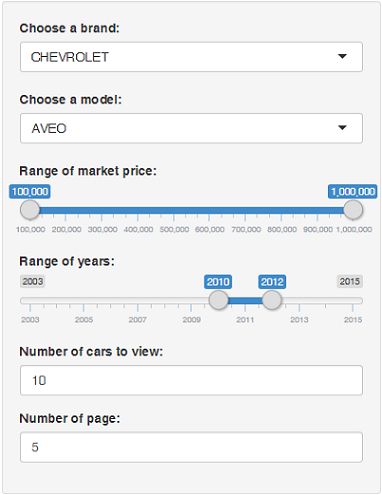

## General description

My shiny application is a simple example of selection of car on the market. Of course, it does not reflect the real situation in the market and does not represent all possible lineup of cars.

Shiny application consists of two files - <span class="bold">server.R</span> and <span class="bold">ui.R</span>. 

File <span class="bold italic">ui.R</span> intended to describe the user interface through which the user interacts with the application.
File <span class="bold italic">server.R</span> actually implements the logic of the application and loads the required data (once).

--- .functionality

## Functionality

To display a list of cars must select the brand and model. Brands and models related: model list is filled with the chosen brand.
<p class="name_elem">Range of market price</p>
Limits the market price of the car. Properties: minimum value = 100,000, maximum value = 1,000,000, step = 20,000. Default values: 100,000 and 1,000,000.
<p class="name_elem">Range of years</p>
Limits on car production year. Properties: minimum value = 2013, maximum value = 2015, step = 1. Default values: 2013 and 2015.
<p class="name_elem">Number of cars to view</p>
Used to change the number of cars that appear in the list. Properties: minimum value = 5, maximum value = 20. Default value: 15.
<p class="name_elem">Number of page</p>
Used to navigate through the pages. NOTE: Will be displayed after the model selection.
<p class="name_elem">Other information</p>
Above the list output the total number of cars and the number of pages.

---

## Example, part 1

The following shows a text description of the request to the server:

- brand: Chevrolet
- model: AVEO
- market price range: 100,000 - 1,000,000
- year of production: 2010 - 2012
- numbers of cars to view: 10
- numbers of page: 5

and...

--- &twocol_with_width

## Example, part 2

*** =left width:50%

so it will look like on form:



*** =right width:50%

and the result is that the server returns:

```{r echo=FALSE}

carsTable <- read.csv("data/cars.csv", sep=";")
carsTable <- transform(carsTable, 
                        brand = as.character(brand), 
                        brands_id = as.integer(brands_id),
                        model = as.character(model), 
                        models_id = as.character(models_id), 
                        market_price = as.integer(market_price), 
                        year = as.integer(year)
                       )

cars = data.frame(carsTable[
                        carsTable$models_id == 1320 &
                            carsTable$market_price >= 100000 &
                            carsTable$market_price <= 1000000 &
                            carsTable$year >= 2010 &
                            carsTable$year <= 2012, 
                        c("brand", "model", "market_price", "year")])

names(cars) <- c("brand" = "Brand", "model" = "Model", "market_price" = "Market price", "year" = "Year")
rownames(cars) <- NULL

head(cars[41:50,], n = 10)

```

and some total values:

```{r echo=FALSE}

paste("Total: ", nrow(cars), "Count pages: ", ceiling(nrow(cars) / 10))

```

---

## P.S.

Presentation created within the course project at class "Developing Data Products".
